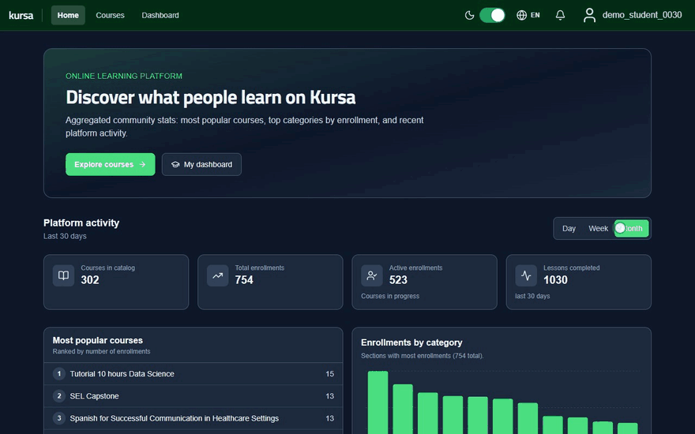
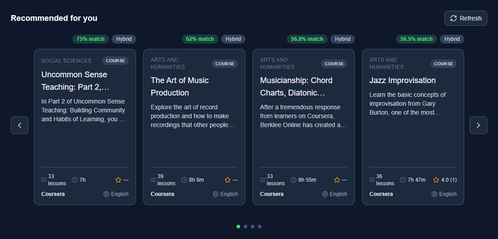
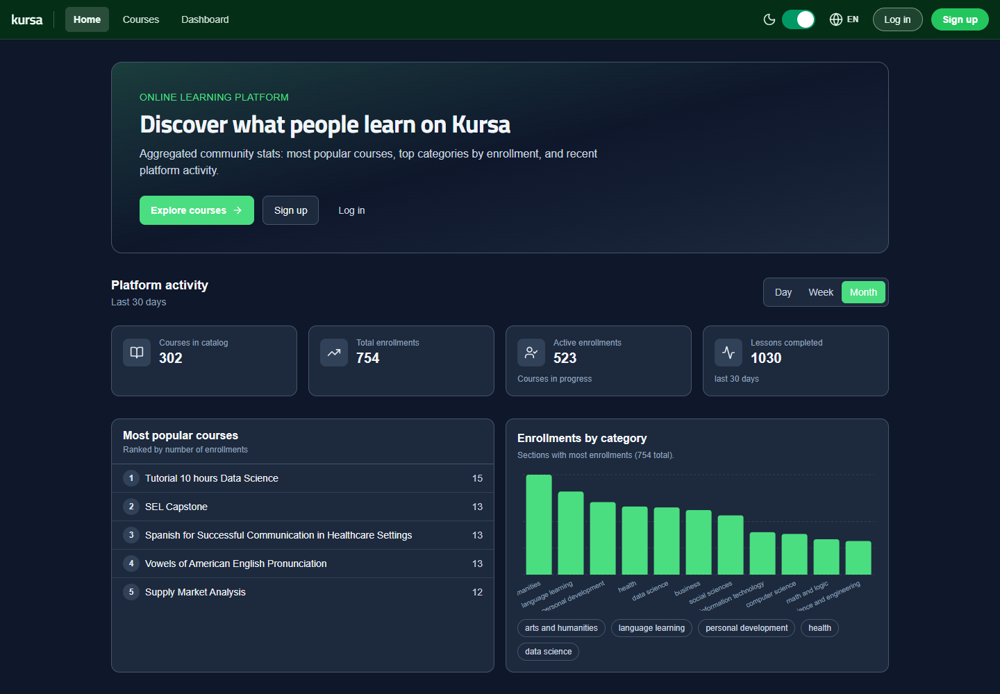
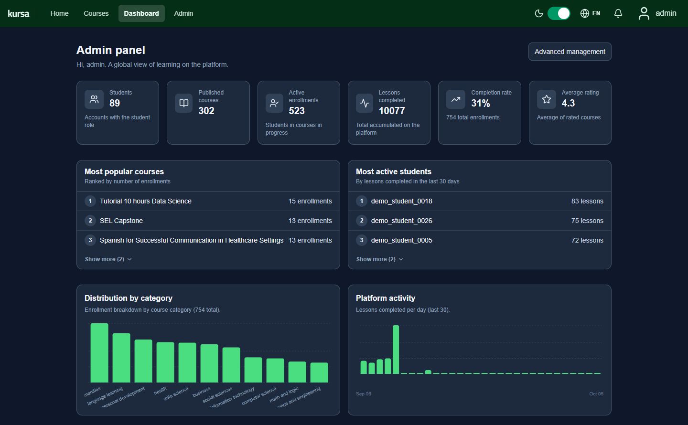
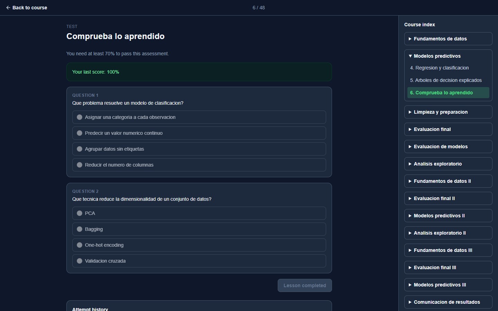
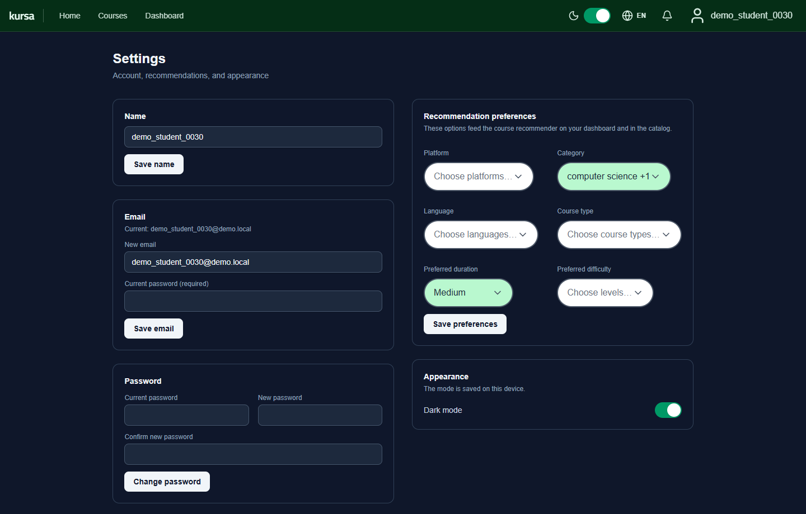
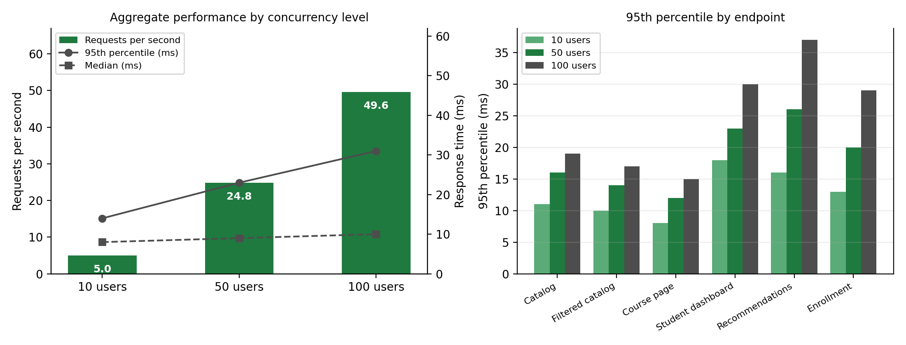

<div align="center">

# Kursa

**Online learning platform with a hybrid recommendation engine built from scratch**

Bachelor's Thesis · Computer Engineering (UNED) · José Manuel Ramos Chica

[Español](README.md) · **English**




</div>

## At a glance

- **What it is:** a full-stack online learning platform (in the spirit of Coursera or Udemy) with three roles: student, instructor and admin.
- **The AI core:** a **hybrid recommender system** that combines content-based filtering, a profile learned from the student's history and **collaborative filtering**. Every recommendation explains why it is shown.
- **Real data:** the catalog comes from a Kaggle dataset of **8,092 courses**, explored and cleaned with pandas in a notebook.
- **Solid engineering:** REST API with FastAPI and PostgreSQL, secure authentication, Docker, tests and load testing (**p95 of 31 ms with 100 concurrent users and 0 errors**).

## 🧠 Recommendation engine

Written in plain Python, with no recommender libraries, so every step can be controlled and explained. Code in [`backend/modules/recommendations`](backend/modules/recommendations).


| Strategy | When it is used | How it scores |
|---|---|---|
| **Content-based** | New users (*cold start*) | Share of the user's stated preferences the course meets, over 6 attributes: platform, category, language, type, duration and difficulty |
| **History profile** | Students with finished courses | Frequency of those 6 attributes in what they have already completed (implicit preferences) |
| **Collaborative filtering** | From 3 enrollments on | User-based, with cosine similarity over *implicit feedback* (progress and rating) |
| **Hybrid** | Collaborative + preferences | Weighted blend; if it returns nothing, it falls back to content-based |

Collaborative filtering in three formulas: weight of each interaction, similarity between students and score of a candidate course (normalized to [0, 1]; a missing rating counts as 2.5).

```math
w_{u,c} = 0.5\cdot\frac{\text{progress}_{u,c}}{100} + 0.5\cdot\frac{\text{rating}_{u,c}}{5}
\qquad
\text{sim}(u,v) = \frac{\mathbf{w}_u \cdot \mathbf{w}_v}{\lVert \mathbf{w}_u \rVert \, \lVert \mathbf{w}_v \rVert}
\qquad
s_u(c) = \sum_{v \neq u} \text{sim}(u,v)\, w_{v,c}
```

- **Explainable:** each recommendation returns its match % and its source (preferences, history, collaborative or hybrid).
- **Exact and efficient:** only students who share at least one course with the user are loaded. Everyone else would have similarity 0, so the result is identical to loading them all. Candidates are prefiltered in SQL and the top N is taken with a *heap*.
- **Measured and tested:** p95 of 37 ms on `/recommendations/me` with 100 concurrent users, per-stage timings in the logs and unit tests for the algorithm in [`test/recommender`](test/recommender).

<p align="center">
  
</p>

## 📊 Data: from Kaggle to the catalog

The [analysis notebook](backend/data_analysis/courses-data-kaggle.ipynb) explores and cleans the [Online Courses](https://www.kaggle.com/datasets/khaledatef1/online-courses) dataset with pandas (8,092 courses and 45 columns from Coursera, FutureLearn, Udacity and Simplilearn), down to **5,273 courses and 11 useful columns**:

- Columns selected by their share of non-null values, and redundant information dropped.
- Free-text durations, written differently on each platform, converted to seconds with regular expressions.
- Text ratings converted to numbers and categories written in several languages unified.
- A category-balanced sample imported into PostgreSQL, so no filter ends up empty.

To give collaborative filtering something to learn from, a **simulator** creates synthetic students, each with their own tastes and skill level, who enroll, make progress, take tests and rate courses over the last few months.

## ✨ The application

- Catalog with search, filters and sorting (the state lives in the URL, so it can be shared).
- Courses organized into topics, with text (Markdown), video, auto-graded tests and assignments graded by the instructor.
- Progress tracking, attempt history and notifications.
- Analytics dashboards for every role: cohort comparison, completion rate, daily activity...
- Spanish and English, dark mode and a responsive layout.

<table>
  <tr>
    <td width="50%"></td>
    <td width="50%"></td>
  </tr>
  <tr>
    <td align="center"><sub>Home page with public platform stats</sub></td>
    <td align="center"><sub>Admin panel</sub></td>
  </tr>
  <tr>
    <td width="50%"></td>
    <td width="50%"></td>
  </tr>
  <tr>
    <td align="center"><sub>Lesson with an auto-graded test and attempt history</sub></td>
    <td align="center"><sub>Preferences that feed the recommender</sub></td>
  </tr>
</table>

## 🛠️ Stack and techniques

**Languages:** Python · TypeScript · SQL · HTML/CSS

| Area | Technologies |
|---|---|
| ML and data | pandas, NumPy, Matplotlib, Jupyter |
| Backend | FastAPI, Pydantic, SQLAlchemy 2, Alembic, PostgreSQL |
| Frontend | React 19, Vite, Tailwind CSS, MUI, Recharts, i18next |
| Quality | pytest, Vitest, React Testing Library, Locust |
| Infrastructure | Docker Compose, uv |

**Programming techniques**

- Domain-based modular architecture (routes, services, models and schemas) with dependency injection.
- ORM and more than 20 versioned migrations; indexes and SQL computed columns for the most frequent queries.
- Security: short-lived JWTs with a rotated *refresh token* in an HttpOnly cookie, bcrypt, role-based access control, *rate limiting*, lockout after failed logins and security headers (CSP).
- Concurrency: simultaneous requests on the same progress record handled without 500 errors.
- Typed frontend with reusable *custom hooks* and a centralized API layer.

## ⚡ Performance and quality

Load testing with Locust at 10, 50 and 100 concurrent users: **0 errors** and an overall p95 of 14, 23 and 31 ms. The test suite (pytest and Vitest) is described in [`test/README.md`](test/README.md) (in Spanish).

<p align="center">
  
</p>

## 🔭 Next steps

- Text *embeddings* over titles and descriptions to measure semantic similarity between courses.
- Matrix factorization to scale collaborative filtering.
- Offline evaluation of the recommender with ranking metrics (precision@k, recall@k, NDCG).

---

## 🚀 Run it locally

```bash
git clone https://github.com/joseramos-dev/web_app_courses.git
cd web_app_courses
```

### Option A: Docker (recommended)

All you need is **Docker Desktop** running.

1. Copy `docker/.env.example` to `docker/.env` and set a long, random `SECRET_KEY`. `DATABASE_URL` uses the host `db` and must match the Postgres user, password and database in that same file.
2. From the `docker` folder:

```bash
docker compose up --build
```

Migrations run automatically on startup. The first run can take a while.

### Option B: without Docker

Requirements: Python 3.12+ with [uv](https://docs.astral.sh/uv/), Node.js 22 and PostgreSQL 16, with the user, password and database already created.

1. Copy `backend/.env.example` to `backend/.env`, with `DATABASE_URL` pointing to `localhost:5432` (not `db`). Always include `ALGORITHM=HS256`: without it, login works but every authenticated route returns 401.
2. Backend, from `backend`:

```bash
uv run alembic upgrade head
uv run uvicorn main:app --reload
```

3. Frontend, in another terminal from `frontend`:

```bash
npm install
npm run dev
```

### URLs

| What | URL |
|---|---|
| Frontend | http://localhost:5173 |
| API | http://localhost:8000 |
| Swagger (the easiest way to try the API) | http://localhost:8000/docs |
| ReDoc | http://localhost:8000/redoc |

### Accounts and demo data

The database starts empty.

1. **Create the admin** (username `admin`, email `admin@admin`, password `admin`): from `backend`, `uv run python -m scripts.bootstrap_admin`, or in Swagger with `POST /users/bootstrap_admin`.
2. **Fill the database:** log in as admin and use the development data buttons in the admin panel:
   - **Seed Courses:** imports courses with topics and lessons.
   - **Seed Users:** creates demo students and instructors (each password is the account's own username).
   - **Simulate Students:** generates realistic activity (enrollments, completed lessons, ratings) for the recommender and the dashboards.
   - **Remove Users / Reset Database:** deletes the demo users or empties the tables (optionally keeping users).

   They only show up with `ENABLE_DEV_ROUTES=true`, which is on by default outside production. The same from the terminal, in `backend`: `uv run python -m scripts.populate_courses`, `scripts.seed_demo_data` and `scripts.simulate_students`.
3. You can also sign up from the UI as a student or instructor.

### Notes

- **Password recovery locally:** without `SMTP_*` variables no email is sent, but the link is logged as a `WARNING` in the backend terminal. To actually send it, fill in the `SMTP_*` variables from `docker/.env.example` (for example, with a Mailtrap sandbox).
- **API URL in the frontend:** `http://localhost:8000` by default. If it changes, copy `frontend/.env.example` to `frontend/.env.local` and set `VITE_API_URL`.
