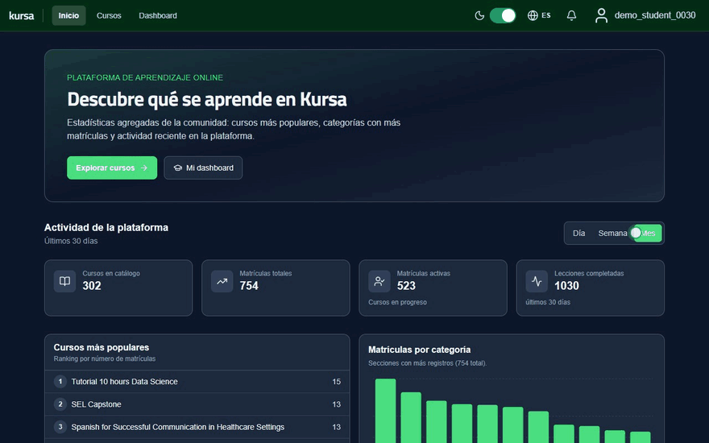
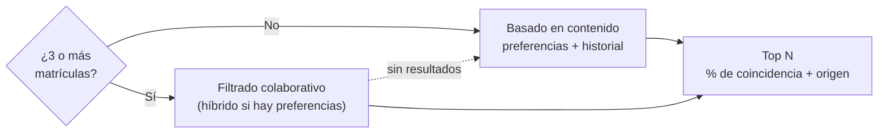
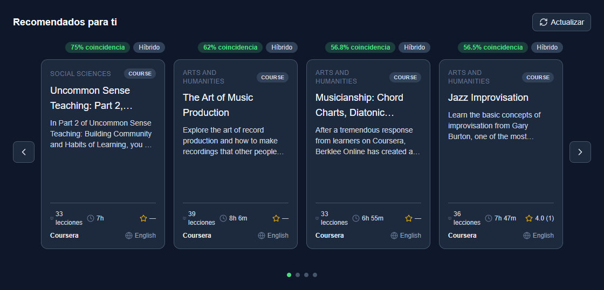
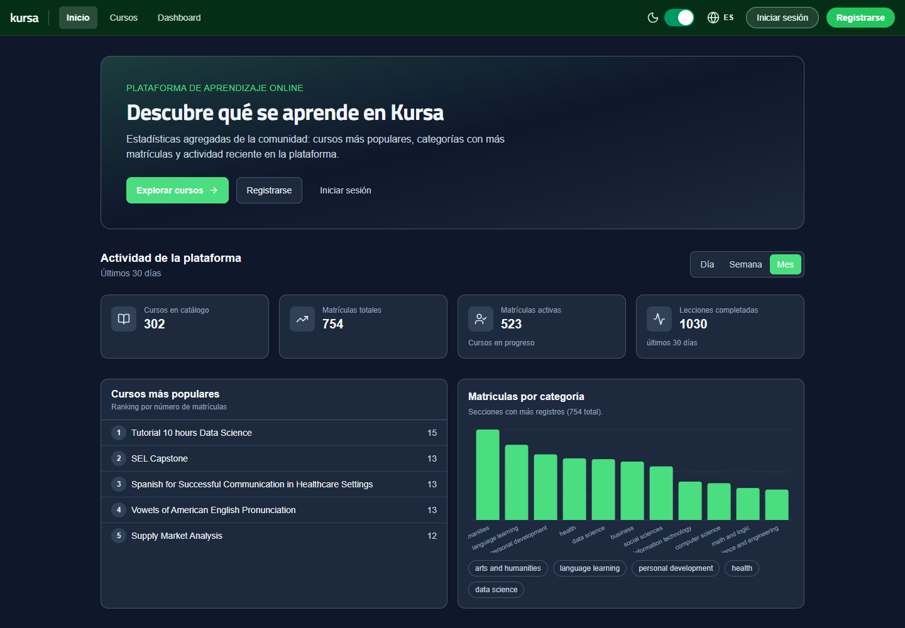
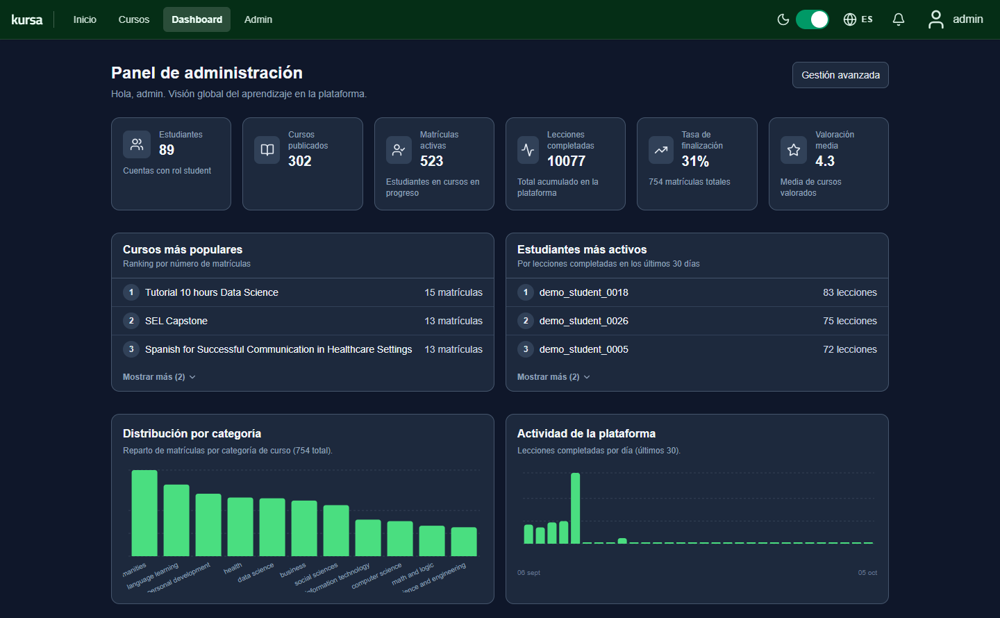
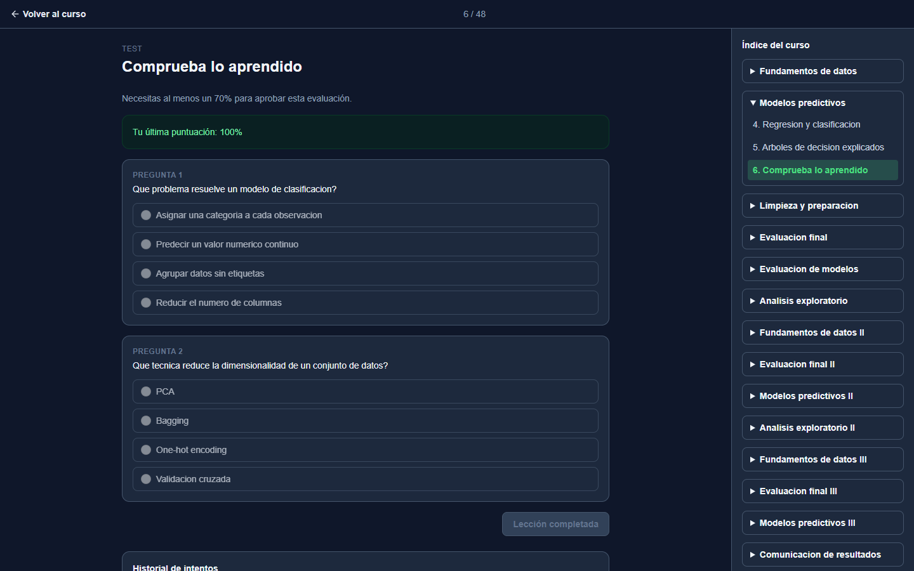
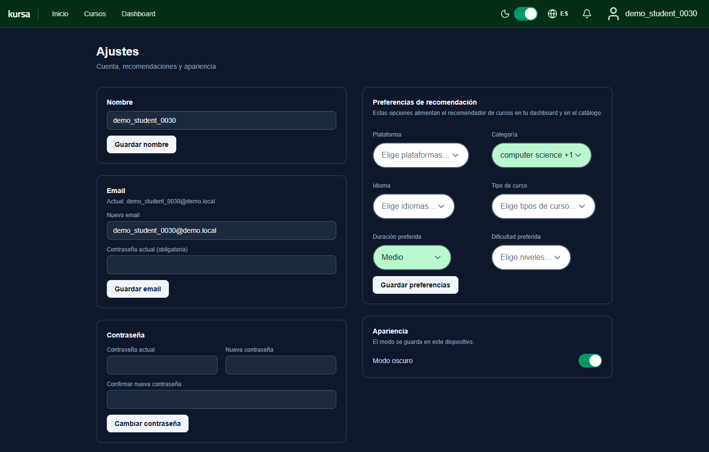
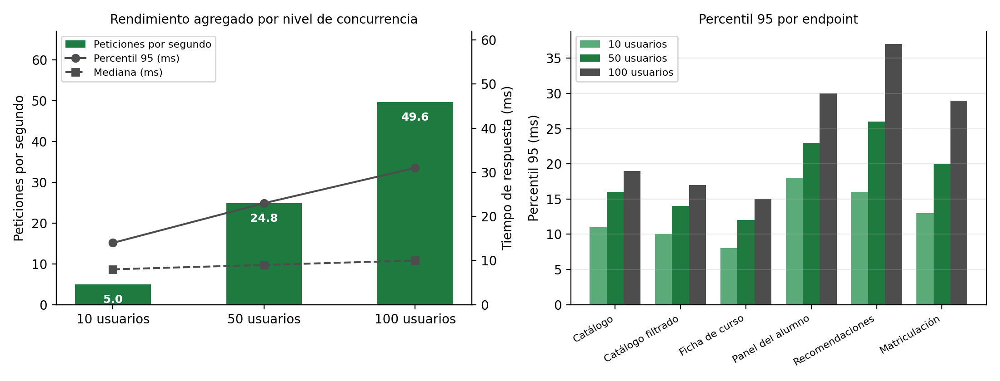

<div align="center">

# Kursa

**Plataforma de cursos online con un motor de recomendación híbrido hecho desde cero**

Trabajo Fin de Grado · Ingeniería Informática (UNED) · José Manuel Ramos Chica

**Español** · [English](README.en.md)




</div>

## En pocas palabras

- **Qué es:** una plataforma web completa de aprendizaje online (al estilo de Coursera o Udemy) con tres roles: estudiante, instructor y administrador.
- **El núcleo de IA:** un **sistema de recomendación híbrido** que combina filtrado basado en contenido, un perfil aprendido del historial del alumno y **filtrado colaborativo**. Cada recomendación explica por qué aparece.
- **Datos reales:** el catálogo sale de un dataset de Kaggle con **8.092 cursos**, explorado y limpiado con pandas en un notebook.
- **Ingeniería sólida:** API REST con FastAPI y PostgreSQL, autenticación segura, Docker, tests y pruebas de carga (**p95 de 31 ms con 100 usuarios concurrentes y 0 errores**).

## 🧠 Motor de recomendación

Escrito en Python puro, sin librerías de recomendación, para controlar y poder explicar cada paso. Código en [`backend/modules/recommendations`](backend/modules/recommendations).



| Estrategia | Cuándo se usa | Cómo puntúa |
|---|---|---|
| **Basada en contenido** | Usuarios nuevos (*cold start*) | Qué parte de las preferencias declaradas cumple el curso, sobre 6 atributos: plataforma, categoría, idioma, tipo, duración y dificultad |
| **Perfil por historial** | Alumnos con cursos terminados | Frecuencia de esos 6 atributos en lo que ya ha completado (preferencias implícitas) |
| **Filtrado colaborativo** | A partir de 3 matrículas | Usuario a usuario, con similitud coseno sobre *feedback implícito* (progreso y valoración) |
| **Híbrido** | Colaborativo + preferencias | Mezcla ponderada; si no da resultados, vuelve al basado en contenido |

El filtrado colaborativo en tres fórmulas: peso de cada interacción, similitud entre alumnos y puntuación de un curso candidato (normalizada a [0, 1]; si no hay valoración se usa 2,5).

```math
w_{u,c} = 0.5\cdot\frac{\text{progreso}_{u,c}}{100} + 0.5\cdot\frac{\text{rating}_{u,c}}{5}
\qquad
\text{sim}(u,v) = \frac{\mathbf{w}_u \cdot \mathbf{w}_v}{\lVert \mathbf{w}_u \rVert \, \lVert \mathbf{w}_v \rVert}
\qquad
s_u(c) = \sum_{v \neq u} \text{sim}(u,v)\, w_{v,c}
```

- **Explicable:** cada recomendación devuelve su % de coincidencia y su origen (preferencias, historial, colaborativo o híbrido).
- **Exacto y eficiente:** solo se cargan los alumnos que comparten algún curso con el usuario. El resto tendría similitud 0, así que el resultado es idéntico al de cargarlos a todos. Los candidatos se prefiltran en SQL y el top N se saca con un *heap*.
- **Medido y probado:** p95 de 37 ms en `/recommendations/me` con 100 usuarios concurrentes, tiempos por fase en los logs y tests unitarios del algoritmo en [`test/recommender`](test/recommender).

<p align="center">
  
</p>

## 📊 Datos: de Kaggle al catálogo

En el [notebook de análisis](backend/data_analysis/courses-data-kaggle.ipynb) se explora y limpia con pandas el dataset [Online Courses](https://www.kaggle.com/datasets/khaledatef1/online-courses) (8.092 cursos y 45 columnas, de Coursera, FutureLearn, Udacity y Simplilearn), hasta dejar **5.273 cursos y 11 columnas útiles**:

- Selección de columnas según su cobertura de valores no nulos y eliminación de información redundante.
- Duraciones en texto libre, distintas en cada plataforma, convertidas a segundos con expresiones regulares.
- Valoraciones de texto a número y categorías escritas en varios idiomas unificadas.
- Importación a PostgreSQL de una muestra equilibrada por categoría, para que ningún filtro quede vacío.

Para que el filtrado colaborativo tenga de qué aprender, un **simulador** genera alumnos sintéticos, cada uno con sus gustos y su nivel, que se matriculan, avanzan, hacen tests y valoran cursos a lo largo de los últimos meses.

## ✨ La aplicación

- Catálogo con búsqueda, filtros y ordenación (el estado vive en la URL, así que se puede compartir).
- Cursos organizados en temas, con lecciones de texto (Markdown), vídeo, tests autocorregidos y entregas que califica el instructor.
- Progreso, historial de intentos y notificaciones.
- Dashboards con analítica para cada rol: comparativa con la cohorte, tasa de finalización, actividad diaria...
- Español e inglés, modo oscuro y diseño adaptable a móvil.

<table>
  <tr>
    <td width="50%"></td>
    <td width="50%"></td>
  </tr>
  <tr>
    <td align="center"><sub>Inicio con estadísticas públicas de la plataforma</sub></td>
    <td align="center"><sub>Panel de administración</sub></td>
  </tr>
  <tr>
    <td width="50%"></td>
    <td width="50%"></td>
  </tr>
  <tr>
    <td align="center"><sub>Lección con test autocorregido e historial de intentos</sub></td>
    <td align="center"><sub>Preferencias que alimentan el recomendador</sub></td>
  </tr>
</table>

## 🛠️ Stack y técnicas

**Lenguajes:** Python · TypeScript · SQL · HTML/CSS

| Área | Tecnologías |
|---|---|
| ML y datos | pandas, NumPy, Matplotlib, Jupyter |
| Backend | FastAPI, Pydantic, SQLAlchemy 2, Alembic, PostgreSQL |
| Frontend | React 19, Vite, Tailwind CSS, MUI, Recharts, i18next |
| Calidad | pytest, Vitest, React Testing Library, Locust |
| Infraestructura | Docker Compose, uv |

**Técnicas de programación**

- Arquitectura modular por dominio (rutas, servicios, modelos y esquemas) con inyección de dependencias.
- ORM y más de 20 migraciones versionadas; índices y columnas calculadas en SQL para las consultas más usadas.
- Seguridad: JWT de corta duración con *refresh token* rotado en cookie HttpOnly, bcrypt, control de acceso por roles, *rate limiting*, bloqueo tras intentos fallidos y cabeceras de seguridad (CSP).
- Concurrencia: peticiones simultáneas sobre el mismo progreso resueltas sin errores 500.
- Frontend tipado con *custom hooks* reutilizables y una capa de API centralizada.

## ⚡ Rendimiento y calidad

Pruebas de carga con Locust a 10, 50 y 100 usuarios concurrentes: **0 errores** y p95 global de 14, 23 y 31 ms. La suite de tests (pytest y Vitest) está descrita en [`test/README.md`](test/README.md).

<p align="center">
  
</p>

## 🔭 Siguientes pasos

- *Embeddings* de texto sobre títulos y descripciones para medir la similitud semántica entre cursos.
- Factorización de matrices para escalar el filtrado colaborativo.
- Evaluación offline del recomendador con métricas de ranking (precision@k, recall@k, NDCG).

---

## 🚀 Ejecutar en local

```bash
git clone https://github.com/joseramos-dev/web_app_courses.git
cd web_app_courses
```

### Opción A: Docker (recomendada)

Solo hace falta tener **Docker Desktop** abierto.

1. Copia `docker/.env.example` a `docker/.env` y pon un `SECRET_KEY` largo y aleatorio. `DATABASE_URL` usa el host `db` y debe coincidir con el usuario, contraseña y base de datos de Postgres de ese mismo fichero.
2. Desde la carpeta `docker`:

```bash
docker compose up --build
```

Las migraciones se aplican solas al arrancar. La primera vez puede tardar un rato.

### Opción B: sin Docker

Requisitos: Python 3.12+ con [uv](https://docs.astral.sh/uv/), Node.js 22 y PostgreSQL 16, con el usuario, la contraseña y la base de datos ya creados.

1. Copia `backend/.env.example` a `backend/.env`, con `DATABASE_URL` apuntando a `localhost:5432` (no a `db`). Incluye siempre `ALGORITHM=HS256`: si falta, el login funciona pero las rutas con sesión devuelven 401.
2. Backend, desde `backend`:

```bash
uv run alembic upgrade head
uv run uvicorn main:app --reload
```

3. Frontend, en otra terminal desde `frontend`:

```bash
npm install
npm run dev
```

### URLs

| Qué | URL |
|---|---|
| Frontend | http://localhost:5173 |
| API | http://localhost:8000 |
| Swagger (la forma más cómoda de probar la API) | http://localhost:8000/docs |
| ReDoc | http://localhost:8000/redoc |

### Cuentas y datos de prueba

La base de datos arranca vacía.

1. **Crea el administrador** (usuario `admin`, email `admin@admin`, contraseña `admin`): desde `backend`, `uv run python -m scripts.bootstrap_admin`, o en Swagger con `POST /users/bootstrap_admin`.
2. **Rellena la base de datos:** inicia sesión como admin y, en el panel de administración, usa los botones de datos de desarrollo:
   - **Seed Courses:** importa cursos con temas y lecciones.
   - **Seed Users:** crea estudiantes e instructores de prueba (su contraseña es su propio nombre de usuario).
   - **Simulate Students:** genera actividad realista (matrículas, lecciones completadas, valoraciones) para el recomendador y los dashboards.
   - **Remove Users / Reset Database:** borra los usuarios de prueba o vacía las tablas (con opción de conservar usuarios).

   Solo aparecen con `ENABLE_DEV_ROUTES=true`, activo por defecto fuera de producción. Lo mismo por terminal, desde `backend`: `uv run python -m scripts.populate_courses`, `scripts.seed_demo_data` y `scripts.simulate_students`.
3. También puedes registrarte desde la interfaz como estudiante o instructor.

### Notas

- **Recuperar contraseña en local:** sin variables `SMTP_*` no se envía ningún correo, pero el enlace aparece como `WARNING` en la terminal del backend. Para enviarlo de verdad, rellena las `SMTP_*` de `docker/.env.example` (por ejemplo, con un sandbox de Mailtrap).
- **URL de la API en el frontend:** por defecto es `http://localhost:8000`. Si cambia, copia `frontend/.env.example` a `frontend/.env.local` y ajusta `VITE_API_URL`.
