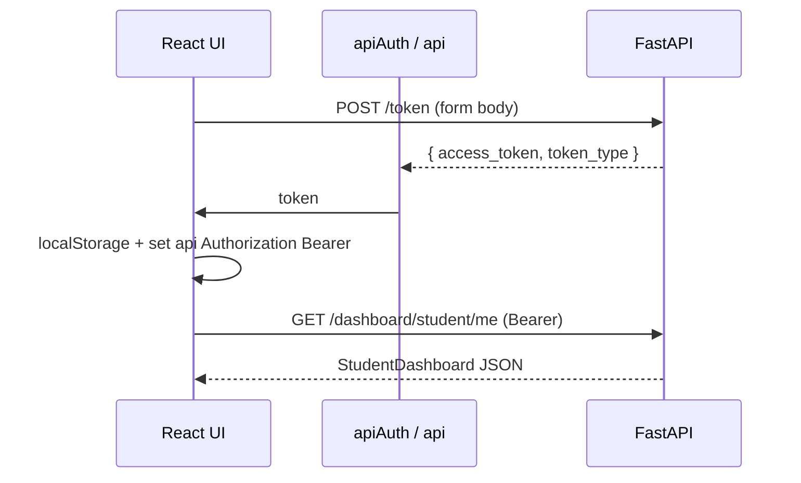

# API and frontend–backend integration

Short map of how the Vite/React client talks to the FastAPI app (`backend/main.py`).

## Base URL and clients

- **Backend entry:** `FastAPI` app on port **8000** (see comments in `backend/main.py` for `uvicorn`).
- **Frontend HTTP layer:** `frontend/src/shared/api/api.tsx` defines three Axios instances, all with **`baseURL: 'http://localhost:8000/'`** (hardcoded; no env-based override in code).
- **`api`** — JSON (`Content-Type: application/json`), used for almost all calls.
- **`apiAuth`** — `application/x-www-form-urlencoded`, used only for OAuth2-style login (`POST /token`).
- **`apiArray`** — same base URL as `api`, but `paramsSerializer` uses `qs` with `arrayFormat: 'repeat'` so multi-value filters (e.g. course list) serialize the way FastAPI expects.

**CORS:** `CORSMiddleware` in `main.py` allows `localhost:5173`, `127.0.0.1:5173`, `3000` variants, credentials, all methods/headers.

## Authentication

| Mechanism | Where |
|-----------|--------|
| **JWT in `Authorization: Bearer …`** | After login, `AuthContext` sets `api.defaults.headers.common["Authorization"] = \`Bearer ${token.access_token}\`` and restores it from `localStorage` on load (`frontend/src/shared/povider/AuthContext.tsx`). |
| **Token storage** | `localStorage` keys `user` (JSON) and `token` (raw access string). No HTTP-only cookies for the API session in this codebase. |
| **Login request** | `apiAuth.post("/token", new URLSearchParams({ username, password }))` — same shape as `OAuth2PasswordRequestForm` (`frontend/src/features/auth/api.ts`, `backend/modules/auth/routes.py`). |
| **Backend validation** | `OAuth2PasswordBearer(tokenUrl="token")` in `backend/core/security.py`; `get_current_user` decodes JWT via `jose` (`backend/modules/auth/service.py`). |

**Register:** `POST /users` with JSON body (`UserCreateSchema` on server; `API_register` uses `api`).

**Current user / profile:** `GET /me` (Bearer), `PATCH /me` for self-update (`settings/api.ts`).

## Request/response patterns

- **JSON bodies** on `api` for creates/updates (courses, lessons, progress answers, etc.).
- **Paginated list:** `GET /courses` with query params `limit`, `offset`, `search`, repeated filter keys, `sort_by`, `order` — response matches `CoursePaginatedSchema` (see `courses/routes.py`).
- **Semantic HTTP status:** e.g. `GET /enrollments/me/course/{id}` returns **404** when not enrolled; the client maps that to `null` in `API_getMyEnrollment` (`course_detail/api.ts`).

## Endpoints by feature (representative)

Routers are included at **root** in `main.py` (no global `/api` prefix).

| Area | Prefix / examples | Auth |
|------|-------------------|------|
| **Auth** | `POST /token`, `GET/PATCH /me` | `POST /token` public; `/me` requires Bearer |
| **Users** | `GET/POST /users`, `DELETE /users/{id}`, `PATCH /users/{id}/role/{role}` (admin) | Mixed; role change uses `require_role` |
| **Courses** | `GET /courses`, `GET /courses/{id}`, `POST /courses/create`, `PUT /courses/{id}`, lessons nested, ratings, reorder | Public read for many GETs; writes need user where `Depends(get_current_user)` |
| **Lessons** | `GET /lessons/...`, `POST/PATCH/DELETE` lesson and question routes under `/lessons` | Per-route `get_current_user` / editor checks |
| **Enrollments** | `POST /enrollments/{course_id}`, `GET /enrollments/me`, `GET /enrollments/me/course/{course_id}`, completion helpers | Student-oriented; `get_current_user` |
| **Progress** | `GET /progress/lesson/{id}`, `POST .../start`, `POST .../complete` | Bearer required |
| **Dashboard** | `GET /dashboard/student/me`, `/dashboard/instructor/me`, `/dashboard/admin` | `require_role` per route |

Concrete client paths live under `frontend/src/features/*/api.ts` (e.g. `dashboard/api.ts`, `lesson/api.ts`, `course_edit/api.ts`).

## Error handling (visible in client)

- **Auth register/login:** catch `AxiosError`, read `response?.data?.detail` (FastAPI’s default error shape) or fall back to Spanish user messages (`auth/api.ts`).
- **Settings `PATCH /me`:** handles `detail` as string, validation array, or other (`settings/api.ts`).
- **Admin delete/role:** surfaces `detail` from response (`admin_panel/api.ts`).
- **Courses list:** logs and rethrows (`courses/api.ts`).
- **Enrollment probe:** explicit **404 → null** for “not enrolled” (`course_detail/api.ts`).

Backend uses `HTTPException(status_code=..., detail="...")` throughout; JSON error bodies typically look like `{ "detail": "..." }` or validation lists from Pydantic.

## Typical login + authenticated call (mermaid)

---

*Grounded in `frontend/src/shared/api/api.tsx`, `frontend/src/shared/povider/AuthContext.tsx`, `frontend/src/features/**/api.ts`, and `backend/main.py` plus `backend/modules/*/routes.py`.*
