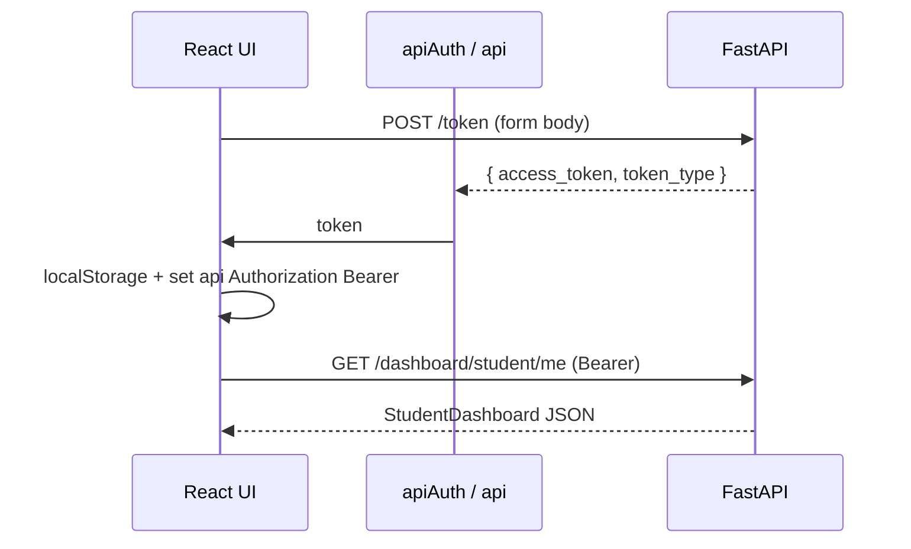

# API e integración frontend-backend

Mapa breve de cómo el cliente Vite/React se comunica con la aplicación FastAPI (`backend/main.py`).

## URL base y clientes

- **Entrada del backend:** aplicación `FastAPI` en el puerto **8000** (consulta los comentarios en `backend/main.py` para `uvicorn`).
- **Capa HTTP del frontend:** `frontend/src/shared/api/api.tsx` define tres instancias de Axios, todas con **`baseURL: 'http://localhost:8000/'`** (hardcodeado; no hay sobrescritura basada en variables de entorno en el código).
- **`api`** — JSON (`Content-Type: application/json`), usado para casi todas las llamadas.
- **`apiAuth`** — `application/x-www-form-urlencoded`, usado solo para el login de estilo OAuth2 (`POST /token`).
- **`apiArray`** — misma URL base que `api`, pero `paramsSerializer` usa `qs` con `arrayFormat: 'repeat'` para que los filtros con múltiples valores (p. ej., lista de cursos) se serialicen como espera FastAPI.

**CORS:** `CORSMiddleware` en `main.py` permite `localhost:5173`, `127.0.0.1:5173`, variantes de `3000`, credenciales y todos los métodos/headers.

## Autenticación

| Mecanismo | Dónde |
|-----------|-------|
| **JWT en `Authorization: Bearer …`** | Después del login, `AuthContext` establece `api.defaults.headers.common["Authorization"] = \`Bearer ${token.access_token}\`` y lo restaura desde `localStorage` al cargar (`frontend/src/shared/povider/AuthContext.tsx`). |
| **Almacenamiento del token** | Claves de `localStorage` `user` (JSON) y `token` (cadena de acceso sin procesar). No hay cookies HTTP-only para la sesión de la API en este codebase. |
| **Petición de login** | `apiAuth.post("/token", new URLSearchParams({ username, password }))` — misma forma que `OAuth2PasswordRequestForm` (`frontend/src/features/auth/api.ts`, `backend/modules/auth/routes.py`). |
| **Validación del backend** | `OAuth2PasswordBearer(tokenUrl="token")` en `backend/core/security.py`; `get_current_user` decodifica el JWT mediante `jose` (`backend/modules/auth/service.py`). |

**Registro:** `POST /users` con cuerpo JSON (`UserCreateSchema` en el servidor; `API_register` usa `api`).

**Usuario actual / perfil:** `GET /me` (Bearer), `PATCH /me` para autoactualización (`settings/api.ts`).

## Patrones de petición/respuesta

- **Cuerpos JSON** en `api` para creaciones/actualizaciones (cursos, lecciones, respuestas de progreso, etc.).
- **Lista paginada:** `GET /courses` con query params `limit`, `offset`, `search`, claves de filtro repetidas, `sort_by`, `order` — la respuesta coincide con `CoursePaginatedSchema` (ver `courses/routes.py`).
- **Estado HTTP semántico:** p. ej., `GET /enrollments/me/course/{id}` devuelve **404** cuando no hay inscripción; el cliente lo transforma en `null` en `API_getMyEnrollment` (`course_detail/api.ts`).

## Endpoints por funcionalidad (representativo)

Los routers se incluyen en la **raíz** en `main.py` (sin prefijo global `/api`).

| Área | Prefijo / ejemplos | Auth |
|------|--------------------|------|
| **Auth** | `POST /token`, `GET/PATCH /me` | `POST /token` público; `/me` requiere Bearer |
| **Users** | `GET/POST /users`, `DELETE /users/{id}`, `PATCH /users/{id}/role/{role}` (admin) | Mixto; el cambio de rol usa `require_role` |
| **Courses** | `GET /courses`, `GET /courses/{id}`, `POST /courses/create`, `PUT /courses/{id}`, lecciones anidadas, valoraciones, reordenación | Lectura pública para muchos GET; las escrituras necesitan usuario donde aparece `Depends(get_current_user)` |
| **Lessons** | `GET /lessons/...`, rutas `POST/PATCH/DELETE` de lecciones y preguntas bajo `/lessons` | `get_current_user` por ruta / comprobaciones de editor |
| **Enrollments** | `POST /enrollments/{course_id}`, `GET /enrollments/me`, `GET /enrollments/me/course/{course_id}`, helpers de finalización | Orientado a estudiantes; `get_current_user` |
| **Progress** | `GET /progress/lesson/{id}`, `POST .../start`, `POST .../complete` | Bearer requerido |
| **Dashboard** | `GET /dashboard/student/me`, `/dashboard/instructor/me`, `/dashboard/admin` | `require_role` por ruta |

Las rutas concretas del cliente están bajo `frontend/src/features/*/api.ts` (p. ej. `dashboard/api.ts`, `lesson/api.ts`, `course_edit/api.ts`).

## Manejo de errores (visible en el cliente)

- **Registro/login de auth:** captura `AxiosError`, lee `response?.data?.detail` (forma de error por defecto de FastAPI) o recurre a mensajes de usuario en español (`auth/api.ts`).
- **Settings `PATCH /me`:** maneja `detail` como string, array de validación u otro (`settings/api.ts`).
- **Admin delete/role:** expone `detail` desde la respuesta (`admin_panel/api.ts`).
- **Lista de cursos:** registra en logs y relanza (`courses/api.ts`).
- **Comprobación de inscripción:** **404 → null** explícito para “no inscrito” (`course_detail/api.ts`).

El backend usa `HTTPException(status_code=..., detail="...")` en todo el código; los cuerpos de error JSON suelen tener la forma `{ "detail": "..." }` o listas de validación de Pydantic.

## Login típico + llamada autenticada (mermaid)

---

*Basado en `frontend/src/shared/api/api.tsx`, `frontend/src/shared/povider/AuthContext.tsx`, `frontend/src/features/**/api.ts` y `backend/main.py`, además de `backend/modules/*/routes.py`.*
