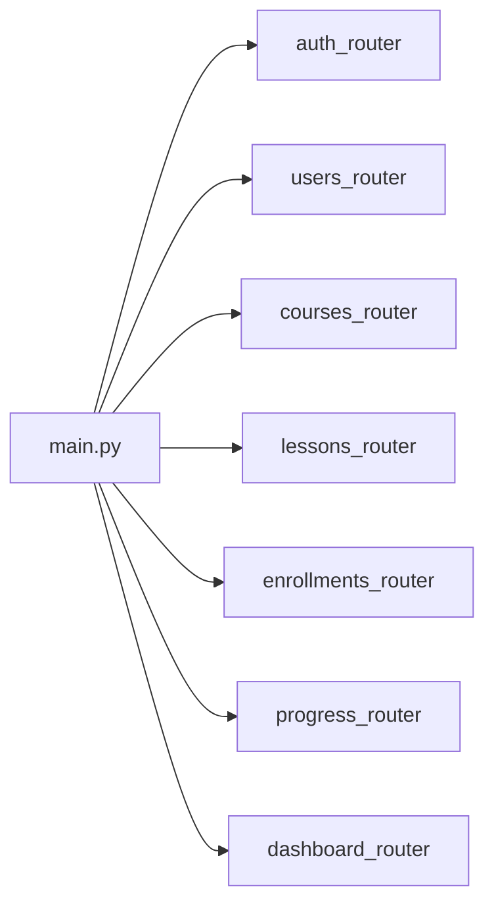

# Resumen del backend

## Pila tecnológica

- **Framework:** FastAPI (`backend/pyproject.toml`: `fastapi`, `uvicorn`)
- **Python:** `requires-python >= 3.12`; el repositorio fija **`3.14`** en `backend/.python-version` (pista local/herramientas; el entorno de ejecución debe cumplir `>=3.12`)
- **BD / ORM:** SQLAlchemy 2.x + migraciones **Alembic**; drivers: `psycopg2-binary`, `psycopg[binary]` → pensado para **PostgreSQL** mediante `DATABASE_URL`
- **Auth:** flujo de contraseña OAuth2 + JWT (`python-jose`), hash bcrypt (`passlib` / `bcrypt`)
- **Config:** `python-dotenv` — variables de entorno cargadas en `core/database.py`, `core/security.py`, Alembic `env.py`, etc.

## Punto de entrada

- **`backend/main.py`** — construye `FastAPI()`, aplica **CORS** (localhost `5173`/`3000`), **`include_router`** para todos los módulos HTTP, raíz `GET /` → `{"status": "ok"}`.

```text
main.py
  └── FastAPI + CORSMiddleware
  └── include_router × 7
```

## Estructura (`backend/`)

| Área | Función |
|------|------|
| `main.py` | Fábrica de la app, cableado de routers |
| `core/` | Infra compartida: `database.py` (engine, `SessionLocal`, `get_db`, `Base`), `security.py` (JWT, bcrypt, `OAuth2PasswordBearer`), `dependencies.py` (`require_role`, helpers de paginación/ordenación de cursos) |
| `modules/*/` | Cortes por funcionalidad: cada uno suele tener `model.py`, `schema.py`, `service.py`, `routes.py` (cuando aplique) |
| `alembic/` | Migraciones; `env.py` importa todos los modelos SQLAlchemy para metadatos de autogenerate |
| `data_analysis/` | Notebooks / CSV (no forman parte del runtime de la API) |

### Módulos de dominio (según el estado actual)

- **`auth`** — `POST /token` (formulario OAuth2), `GET/PATCH /me` (JWT). El router no lleva prefijo de URL.
- **`users`** — prefijo `/users`: listar/crear/borrar usuarios, parche de rol admin, `POST /create_admin` de desarrollo.
- **`courses`** — prefijo `/courses`: APIs estilo CRUD de cursos, paginación; incluye endpoints de **listado/reordenación de lecciones** y **valoración del curso** vía servicio/modelos `course_ratings`.
- **`lessons`** — prefijo `/lessons`: CRUD de lecciones y preguntas, reglas de acceso según matrícula en las rutas.
- **`enrollments`** — prefijo `/enrollments`: matricular por `course_id`, listado/detalle del usuario actual.
- **`progress`** — prefijo `/progress`: inicio/fin de lección, lectura de progreso, envío de respuestas.
- **`dashboard`** — prefijo `/dashboard`: resúmenes por rol (`/student/me`, `/instructor/me`, `/admin`).
- **`course_ratings`** — **sin router propio**; consumido desde las rutas de `courses` y metadatos de Alembic.

## Registro de rutas

Los routers se importan de forma explícita en `main.py` y se montan con `app.include_router(...)`



## Modelo de autenticación

- **Login:** `POST /token` con `OAuth2PasswordRequestForm` → JWT (`sub` = id de usuario, claim `role`).
- **Rutas protegidas:** `Depends(get_current_user)` o `Depends(require_role([...]))` — `require_role` es una factory que comprueba la lista de strings `user.role` (p. ej. dashboard, algunas operaciones de cursos).
- **Extracción del token:** `OAuth2PasswordBearer(tokenUrl="token")` en `core/security.py` — los clientes envían `Authorization: Bearer <jwt>`.

## Entorno

| Variable | Notas |
|----------|--------|
| `DATABASE_URL` | **Obligatoria** — URL SQLAlchemy; la app falla si falta |
| `SECRET_KEY` | **Obligatoria** para firmar JWT |
| `ALGORITHM` | Opcional; por defecto `HS256` en la ruta de `create_access_token` |
| `EXP_TOKEN` | Opcional; vida del JWT en **minutos** (por defecto `30`) |

Coloca `.env` en `/backend`.

## Ejecutar la API en local

Desde **`backend/`** (para que resuelva `main:app` y las rutas de dotenv se comporten como se espera):

```bash
uv run uvicorn main:app --reload
```

(Enlace LAN opcional, como comentado en `main.py`: `uv run uvicorn main:app --host 0.0.0.0 --port 8000`.)

**Migraciones** (desde `backend/`):

```bash
alembic upgrade head
```

Crea revisiones nuevas con `alembic revision --autogenerate -m "..."` cuando cambie el esquema.

---

