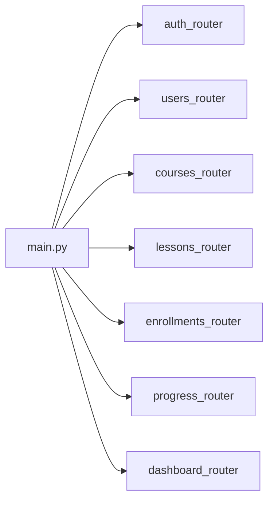

# Backend overview

## Stack

- **Framework:** FastAPI (`backend/pyproject.toml`: `fastapi`, `uvicorn`)
- **Python:** `requires-python >= 3.12`; repo pins **`3.14`** in `backend/.python-version` (local/tooling hint; runtime should satisfy `>=3.12`)
- **DB / ORM:** SQLAlchemy 2.x + **Alembic** migrations; drivers: `psycopg2-binary`, `psycopg[binary]` → intended for **PostgreSQL** via `DATABASE_URL`
- **Auth:** OAuth2 password flow + JWT (`python-jose`), bcrypt hashing (`passlib` / `bcrypt`)
- **Config:** `python-dotenv` — env loaded in `core/database.py`, `core/security.py`, Alembic `env.py`, etc.

## Entry point

- **`backend/main.py`** — builds `FastAPI()`, attaches **CORS** (localhost `5173`/`3000`), **`include_router`** for all HTTP modules, root `GET /` → `{"status": "ok"}`.

```text
main.py
  └── FastAPI + CORSMiddleware
  └── include_router × 7
```

## Layout (`backend/`)

| Area | Role |
|------|------|
| `main.py` | App factory, router wiring |
| `core/` | Shared infra: `database.py` (engine, `SessionLocal`, `get_db`, `Base`), `security.py` (JWT, bcrypt, `OAuth2PasswordBearer`), `dependencies.py` (`require_role`, course pagination/sorting helpers) |
| `modules/*/` | Feature slices: each typically `model.py`, `schema.py`, `service.py`, `routes.py` (where applicable) |
| `alembic/` | Migrations; `env.py` imports all SQLAlchemy models for autogenerate metadata |
| `data_analysis/` | Notebooks / CSV (not part of the API runtime) |

### Domain modules (as present)

- **`auth`** — `POST /token` (OAuth2 form), `GET/PATCH /me` (JWT). No URL prefix on router.
- **`users`** — prefix `/users`: list/create/delete users, admin role patch, dev `POST /create_admin`.
- **`courses`** — prefix `/courses`: CRUD-style course APIs, pagination; embeds **lesson listing/reorder** and **course rating** endpoints via `course_ratings` service/models.
- **`lessons`** — prefix `/lessons`: lessons + questions CRUD, enrollment-aware access rules in routes.
- **`enrollments`** — prefix `/enrollments`: enroll by `course_id`, list/detail for current user.
- **`progress`** — prefix `/progress`: lesson start/complete, progress read, answer submission.
- **`dashboard`** — prefix `/dashboard`: role-scoped summaries (`/student/me`, `/instructor/me`, `/admin`).
- **`course_ratings`** — **no standalone router**; consumed from `courses` routes and Alembic metadata.

## Route registration

Routers are imported explicitly in `main.py` and mounted with `app.include_router(...)` — no auto-discovery.



## Auth model

- **Login:** `POST /token` with `OAuth2PasswordRequestForm` → JWT (`sub` = user id, `role` claim).
- **Protected routes:** `Depends(get_current_user)` or `Depends(require_role([...]))` — `require_role` is a factory that checks `user.role` string list (e.g. dashboard, some course ops).
- **Token extraction:** `OAuth2PasswordBearer(tokenUrl="token")` in `core/security.py` — clients send `Authorization: Bearer <jwt>`.

## Environment

| Variable | Notes |
|----------|--------|
| `DATABASE_URL` | **Required** — SQLAlchemy URL; app raises if missing |
| `SECRET_KEY` | **Required** for signing JWT |
| `ALGORITHM` | Optional; default `HS256` in `create_access_token` path |
| `EXP_TOKEN` | Optional; JWT lifetime in **minutes** (default `30`) |

Place `.env` where the process cwd can load it (typically run commands from `backend/`).

## Run API locally

From **`backend/`** (so `main:app` resolves and dotenv paths behave as expected):

```bash
uv run uvicorn main:app --reload
```

(Optional LAN bind, as commented in `main.py`: `uv run uvicorn main:app --host 0.0.0.0 --port 8000`.)

**Migrations** (from `backend/`):

```bash
alembic upgrade head
```

Create new revisions with `alembic revision --autogenerate -m "..."` when schema changes.

---

**Gaps / caveats (repo truth):** `course_ratings` is only wired through **courses** routes, not its own router; several **`/users`** handlers have no `Depends(get_current_user)`** in code (open list/create/delete unless another layer exists); `POST /users/create_admin` is explicitly marked as dev-only in a TODO comment.
