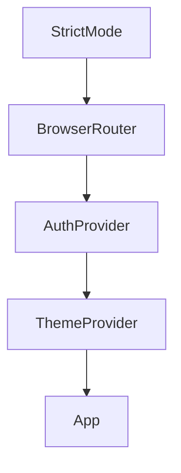
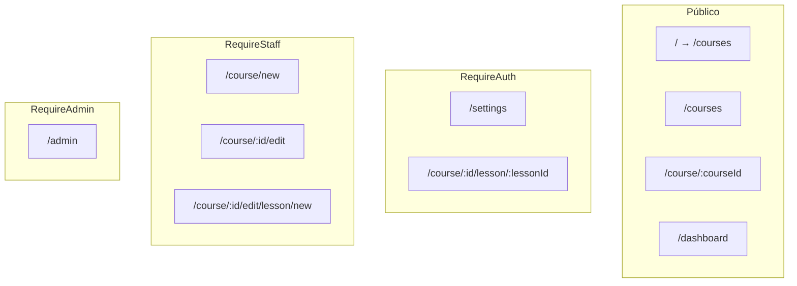
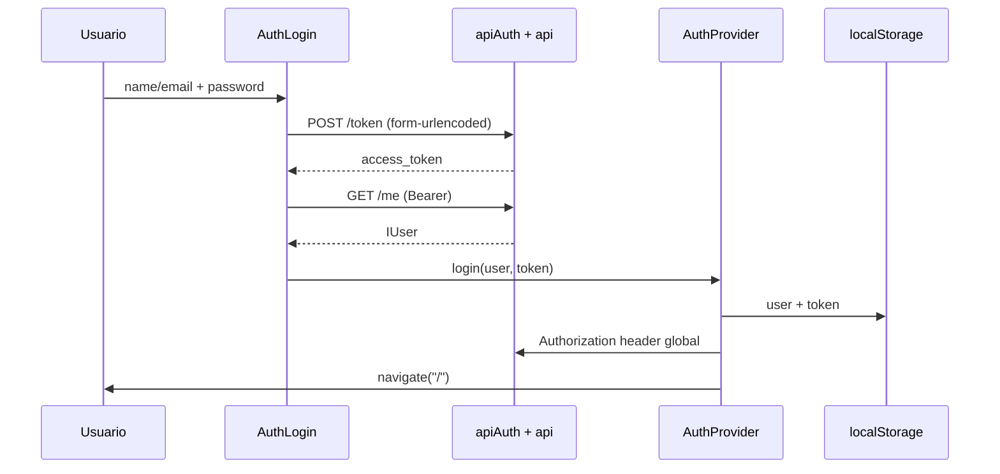
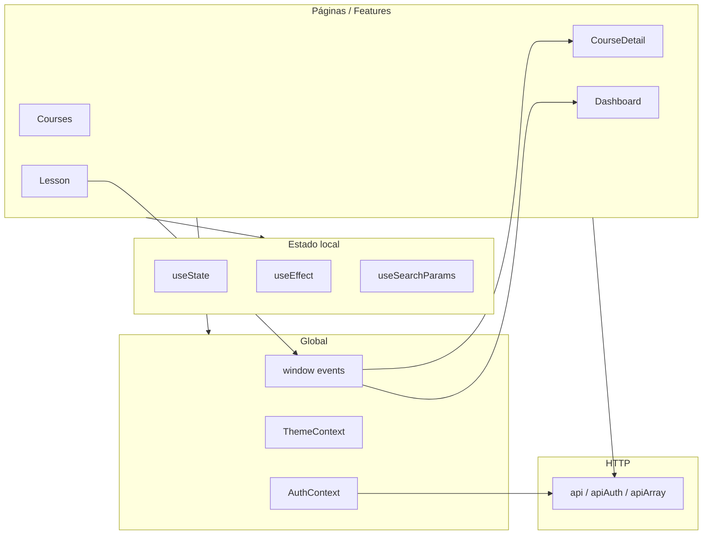

# Frontend — Kursa

Documentación técnica del cliente web de **Kursa**, plataforma de cursos online del TFG. El frontend es una SPA (Single Page Application) que consume la API FastAPI del backend (URL configurable vía `VITE_API_URL`).

Para el contrato HTTP detallado (JWT, códigos de error, ejemplos), véase también [api-and-integration.md](../api-and-integration.md).

---

## Stack tecnológico

| Capa | Tecnología | Versión / notas |
|------|------------|-----------------|
| Build y dev server | **Vite** | 8.x, plugin `@vitejs/plugin-react` |
| UI | **React** + **TypeScript** | React 19, TS ~6 |
| Enrutado | **react-router-dom** | 7.x — `BrowserRouter`, rutas declarativas |
| Estilos | **Tailwind CSS** 4 | Plugin `@tailwindcss/vite`; variante `dark` vía clase en `<html>` |
| Componentes UI | **MUI** 9 | `@mui/material` + Emotion; usado p. ej. en paginación |
| Iconos | **lucide-react** | Nav, dashboards, estados de lección |
| Gráficos | **Recharts** | 3.x — dashboards (actividad, progreso de cursos) |
| HTTP | **Axios** | Tres instancias compartidas; **qs** para arrays en query |
| Notificaciones | **react-hot-toast** | Toasts globales en `App.tsx` |

**Punto de entrada:** `src/main.tsx` monta la aplicación con este árbol de providers:



---

## Estructura de carpetas

```text
frontend/
├── index.html                 # Shell HTML; favicon en public/
├── vite.config.ts             # React + Tailwind Vite plugin
├── tailwind.config.js         # content paths (complementa @theme en index.css)
├── postcss.config.js
├── package.json
├── public/
│   ├── favicon.svg
│   └── icons.svg
└── src/
    ├── main.tsx               # Bootstrap de providers
    ├── App.tsx                # Layout, rutas, modal auth, Toaster
    ├── index.css              # Tokens CSS, @theme Tailwind, dark mode
    ├── features/              # Módulos por dominio (pantalla + api.ts)
    │   ├── auth/
    │   ├── courses/
    │   ├── course_detail/
    │   ├── course_edit/
    │   ├── course_students/
    │   ├── lesson/
    │   ├── dashboard/
    │   ├── admin_panel/
    │   └── settings/
    └── shared/
        ├── api/api.tsx        # Instancias Axios (api, apiAuth, apiArray)
        ├── components/        # Nav, footer, guards, inputs reutilizables
        │   └── charts/        # Recharts: ActivityBarChart, CourseProgressChart, chartTheme
        ├── context/           # ThemeContext, AuthModalContext
        ├── povider/           # AuthContext (nombre histórico en el repo)
        ├── hooks/             # useDebounce
        ├── interfaces/        # Tipos de respuesta API (IUser, ICourses, …)
        ├── types/             # Enums de dominio (roles, filtros, ordenación)
        └── constants/         # Eventos globales window (appEvents)
```

**Convención de features:** cada carpeta bajo `features/` expone un componente de página raíz (`Courses.tsx`, `Lesson.tsx`, …) y un `api.ts` con funciones async que encapsulan las llamadas HTTP de ese dominio. No hay Redux ni React Query; el estado de servidor se gestiona con `useState` + `useEffect` en los componentes.

---

## Providers y contexto global

### AuthProvider (`shared/povider/AuthContext.tsx`)

Gestiona la sesión del usuario en toda la aplicación.

| Miembro | Descripción |
|---------|-------------|
| `user` | Objeto `IUser` o `null` |
| `login(user, token)` | Persiste en `localStorage`, fija header `Authorization` en Axios, navega a `/` |
| `logout()` | Limpia storage y header, navega a `/` |
| `updateUser(next)` | Actualiza usuario en memoria y `localStorage` (p. ej. tras editar perfil) |
| `isLoading` | `true` hasta restaurar sesión desde `localStorage` al montar |
| `isAdmin()` | Comprueba `user.role === "admin"` |

Al arrancar, si existen `user` y `token` en `localStorage`, se restauran y se configura `api.defaults.headers.common["Authorization"]`.

### ThemeProvider (`shared/context/ThemeContext.tsx`)

- Clave de almacenamiento: `kursa-theme` (`"light"` | `"dark"`).
- Si no hay valor guardado, respeta `prefers-color-scheme: dark`.
- Aplica la clase `dark` en `document.documentElement`.
- Expone `theme`, `setTheme`, `toggleTheme` vía `useTheme()`.

### AuthModalProvider (`shared/context/AuthModalContext.tsx`)

Definido en `App.tsx` con `useMemo`. Ofrece `openLogin()` y `openRegister()` para abrir el overlay de autenticación desde la barra de navegación o desde `GuestAuthGate` sin prop drilling.

---

## Rutas y guards

Todas las rutas se declaran en `App.tsx`. El layout común incluye `SuperiorNavBar`, `<main>` con `<Routes>`, `Footer` y `Toaster`.



| Ruta | Guard | Componente | Acceso |
|------|-------|------------|--------|
| `/` | — | `Navigate` → `/courses` | Todos |
| `/courses` | — | `Courses` | Catálogo público |
| `/dashboard` | — (lógica interna) | `Dashboard` | Invitado: CTA login; autenticado: panel por rol |
| `/profile` | — | `Navigate` → `/settings` | Alias |
| `/settings` | `RequireAuth` | `Settings` | Usuario autenticado |
| `/admin` | `RequireAdmin` | `AdminPanel` | Solo `role === "admin"` |
| `/course/new` | `RequireStaff` | `CourseEdit` | Instructor o admin |
| `/course/:courseId` | — | `CourseDetail` | Ficha pública del curso |
| `/course/:courseId/edit` | `RequireStaff` | `CourseEdit` | Instructor dueño o admin |
| `/course/:courseId/students` | `RequireStaff` | `CourseStudents` | Instructor dueño o admin — progreso de alumnos |
| `/course/:courseId/edit/lesson/new` | `RequireStaff` | `LessonNew` | Crear lección |
| `/course/:courseId/lesson/:lessonId` | `RequireAuth` | `Lesson` | Estudiante matriculado (validado en API) |
| `*` | — | `Navigate` → `/courses` | 404 → catálogo |

### Componentes de guard (`shared/components/RouteGuards.tsx`)

| Guard | Comportamiento si no hay sesión | Comportamiento si rol incorrecto |
|-------|--------------------------------|----------------------------------|
| `RequireAuth` | `GuestAuthGate` con botones login/registro | — |
| `RequireAdmin` | `GuestAuthGate` (mensaje admin) | `Forbidden` |
| `RequireStaff` | `GuestAuthGate` (mensaje instructor) | `Forbidden` |
| `GuestAuthGate` | — | Pantalla invitado reutilizable (también en `/dashboard`) |

`Dashboard` no usa un guard de ruta: delega en `GuestAuthGate` cuando `user` es `null`, y en un `switch` por `user.role` cuando hay sesión.

---

## Autenticación

### Flujo de login



- **Login:** `API_login` en `features/auth/api.ts` — primero `POST /token` con `apiAuth` (`application/x-www-form-urlencoded`, campos `username` y `password`), luego `GET /me` con el token.
- **Registro:** `POST /users` con JSON (`name`, `email`, `password`, `role`). Roles permitidos en UI: `student` | `instructor` (no se puede auto-registrar como `admin`).
- **Modal:** `App` mantiene `authType: "Login" | "Register" | null`. `Auth` renderiza overlay a pantalla completa; si ya hay `user`, cierra el modal.
- **Persistencia:** claves `user` (JSON) y `token` (string JWT) en `localStorage`.

### Roles (`UserRoles`)

| Rol | Capacidades principales en UI |
|-----|------------------------------|
| `student` | Matricularse, ver lecciones, dashboard estudiante, valorar cursos |
| `instructor` | Crear/editar sus cursos y lecciones, dashboard instructor |
| `admin` | Todo lo anterior + panel `/admin`, asignar instructor al crear curso, editar cualquier curso |

---

## Capa API (Axios)

Archivo central: `shared/api/api.tsx`.

| Instancia | Content-Type | Uso |
|-----------|--------------|-----|
| `api` | `application/json` | Mayoría de endpoints; lleva `Authorization` tras login |
| `apiAuth` | `application/x-www-form-urlencoded` | Solo `POST /token` (OAuth2 password flow) |
| `apiArray` | JSON + `paramsSerializer` | `GET /courses` con filtros multi-valor (`qs`, `arrayFormat: 'repeat'`) |

**Base URL:** `VITE_API_URL` en `.env` / `.env.local` (fallback `http://localhost:8000/`). Ver `frontend/.env.example`.

**Sesión:** access + refresh token en `localStorage`. Interceptores en `api` y `apiArray` renuevan el access con `POST /token/refresh` ante 401; `logout` revoca el refresh.

**Timeout:** 5000 ms en las tres instancias.

Cada feature define funciones en su `api.ts` que importan la instancia adecuada. Los errores FastAPI (`detail`) se propagan como strings en auth y settings; en otros módulos suele usarse `console.error` + toast en la UI.

---

## Las 8 features

### 1. `auth` — Autenticación (modal)

| Archivo clave | Responsabilidad |
|---------------|-----------------|
| `Auth.tsx` | Overlay modal; alterna Login/Register |
| `components/AuthLogin.tsx` | Formulario login → `API_login` → `login()` |
| `components/AuthRegister.tsx` | Registro → `API_register` → cambia a Login |
| `api.ts` | `API_register`, `API_login`, `API_refreshToken`, `API_logoutToken` |

No tiene ruta propia; se activa desde la navbar o `GuestAuthGate`.

### 2. `courses` — Catálogo

| Archivo clave | Responsabilidad |
|---------------|-----------------|
| `Courses.tsx` | Listado paginado, búsqueda, filtros, ordenación |
| `components/CourseCard.tsx` | Tarjeta de curso en grid |
| `components/FilterDropDown.tsx` | Filtros multi-select (site, category, language, course_type) |
| `api.ts` | `get_courses` → `GET /courses` |

**Estado en URL:** `search`, `page`, `sort_by`, `order`, y arrays `site`, `category`, `language`, `course_type` vía `useSearchParams`. Los valores se sanitizan contra listas blancas para evitar 422 del backend. Búsqueda con debounce de 500 ms (`useDebounce`). Tamaño de página: 24. Staff ve enlace «Crear curso» → `/course/new`.

### 3. `course_detail` — Ficha del curso

| Archivo clave | Responsabilidad |
|---------------|-----------------|
| `CourseDetail.tsx` | Metadatos, progreso, listado de lecciones |
| `components/DetailActionButton.tsx` | Matricular / continuar / repasar / editar según rol |
| `components/DetailInfo.tsx` | Información del curso |
| `components/StudentCourseRating.tsx` | Valoración 1–5 estrellas (estudiante matriculado) |
| `api.ts` | Detalle, lecciones, matrícula, valoraciones |

Página **pública**; la matrícula y el progreso requieren sesión de estudiante. Escucha `KURSA_COURSE_ENROLLMENT_CHANGED_EVENT` para refrescar matrícula tras completar lecciones.

### 4. `course_edit` — Editor de cursos y lecciones

| Archivo clave | Responsabilidad |
|---------------|-----------------|
| `CourseEdit.tsx` | Modo crear (`/course/new`) o editar; formulario + sidebar lecciones; botón eliminar curso |
| `LessonNew.tsx` | Formulario de nueva lección |
| `components/CourseEditForm.tsx` | Campos del curso; combobox instructor (solo admin) |
| `components/LessonsEditor.tsx` | Lista, edición inline, reordenación, borrado |
| `components/LessonModal.tsx` | Edición de lección; sección «Materiales adjuntos» (subida/borrado) |
| `components/QuestionsEditor.tsx` | Preguntas para lecciones tipo test |
| `lessonTypes.ts` | Tipos `ILesson`, `ILessonFile`, `IQuestion*`, `LessonType` |
| `api.ts` | CRUD curso (incl. delete), lecciones, preguntas, archivos adjuntos, reordenar |

**Permisos en cliente:** admin edita cualquier curso; instructor solo si `course.instructor_id === user.id`. Tras crear curso, redirige a `/course/{id}/edit`.

### 4b. `course_students` — Progreso de alumnos (instructor)

| Archivo clave | Responsabilidad |
|---------------|-----------------|
| `CourseStudents.tsx` | Tabla de matriculados, stat cards (incl. finalización y valoración), gráficos por lección/cohortes/buckets, detalle expandible por lección, **panel de entregas de tareas** |
| `components/SubmissionsPanel.tsx` | Tabla de entregas pendientes/todas; modal de corrección |
| `components/GradeSubmissionModal.tsx` | Nota, feedback, calificar o devolver |
| `api.ts` | `GET /courses/{id}/instructor/enrollments` y `.../{user_id}` |

Ruta `/course/:courseId/students`. Enlaces desde dashboard instructor («Ver alumnos») y ficha del curso (botón junto a «Edit»). Muestra nota e intentos en lecciones tipo test.

En la ficha del curso (`CourseDetail`), el estudiante matriculado ve junto a cada lección test/cuestionario con intentos: «Mejor: X% · N intentos» (datos de `enrollment.lesson_progress`).

### 5. `lesson` — Consumo de lección

| Archivo clave | Responsabilidad |
|---------------|-----------------|
| `Lesson.tsx` | Orquestador por `lesson_type` |
| `components/LessonText.tsx` | Contenido texto |
| `components/LessonVideo.tsx` | Reproductor vídeo (URL externa) |
| `components/LessonQuiz.tsx` | Test / selección múltiple (umbral 70 %) |
| `components/LessonAssignment.tsx` | Tarea manual: enunciado, entrega texto/archivo, estado y feedback |
| `components/LessonAttachments.tsx` | Descarga de PDFs y materiales adjuntos del instructor |
| `components/LessonAttemptHistory.tsx` | Historial cronológico de intentos en quiz |
| `api.ts` | `start`, `complete`, preguntas públicas |

Al entrar: `API_startLesson`. Texto/vídeo: botón «Marcar como completada». Quiz: envía respuestas en `complete`; carga historial con `API_getLessonAttempts` e inicializa la mejor nota desde el progreso. **Tarea (`assignment`):** el alumno envía texto y opcionalmente un archivo (`API_submitLessonAssignment`); consulta su entrega con `API_getLessonSubmission` (estados `pending` / `graded` / `returned`). Tras un intento fallido en quiz, refresca el historial. Tras aprobar quiz, navega a la siguiente lección o vuelve al curso. Dispara eventos de refresco de dashboard y matrícula. **Materiales adjuntos:** `API_getLessonFiles` al cargar; `LessonAttachments` muestra descargas autenticadas (blob vía Axios) en todos los tipos de lección.

**Tipos de lección:** `text` | `video` | `test` | `multiple_selection` | `assignment`.

### 6. `dashboard` — Paneles por rol

| Archivo clave | Responsabilidad |
|---------------|-----------------|
| `Dashboard.tsx` | Router interno por `user.role` |
| `StudentDashboard.tsx` | Estadísticas, cursos en marcha, racha, actividad 7 días, **rendimiento en evaluaciones** (media global, gráficos por curso, comparativa vs cohorte, tabla de intentos recientes) |
| `InstructorDashboard.tsx` | Cursos del instructor, alumnos, progreso medio, finalización y valoración por curso |
| `AdminDashboard.tsx` | Métricas globales, top cursos, gráficos Recharts (categoría, plataforma, dificultad, cohortes) |
| `api.ts` | `GET /dashboard/student/me`, `.../instructor/me`, `.../admin` |

Los gráficos usan **Recharts** vía `shared/components/charts/` (`ActivityBarChart`, `CourseProgressChart`, `DistributionBarChart`, `DistributionPieChart`, `LessonCompletionChart`, `CohortComparisonChart`, `ScoreComparisonChart`), con colores alineados a los tokens `--uned-primary` y `--chart-track` de `index.css`.

`StudentDashboard` escucha `KURSA_DASHBOARD_REFRESH_EVENT` para recargar en silencio tras progreso en lecciones.

### 7. `admin_panel` — Administración de usuarios

| Archivo clave | Responsabilidad |
|---------------|-----------------|
| `AdminPanel.tsx` | Lista de usuarios, cambio de rol, borrado con confirmación |
| `api.ts` | `GET /users`, `DELETE /users/{id}`, `PATCH /users/{id}/role/{role}` |

Ruta protegida con `RequireAdmin`. Distinto del `AdminDashboard` (métricas en `/dashboard`).

### 8. `settings` — Ajustes de cuenta

| Archivo clave | Responsabilidad |
|---------------|-----------------|
| `Settings.tsx` | Nombre, email (con contraseña actual), contraseña |
| `components/SettingsAppearanceSection.tsx` | Toggle tema claro/oscuro |
| `api.ts` | `PATCH /me` |

Protegido con `RequireAuth`. Tras cambios de perfil, `updateUser()` sincroniza `AuthContext`.

---

## Recursos compartidos (`shared/`)

### Componentes de layout y UI

| Componente | Ubicación | Uso |
|------------|-----------|-----|
| `SuperiorNavBar` | `components/` | Cabecera sticky, logo «kursa», nav desktop/móvil |
| `ButtonsNavBar` / `ButtonsNavBarMobile` | `components/` | Enlaces Courses, Dashboard, Admin; auth y menú usuario |
| `Footer` | `components/` | Pie de página |
| `RouteGuards` | `components/` | Guards y pantallas de acceso denegado |
| `InputText`, `InputPassword` | `components/` | Inputs genéricos |

### Interfaces y tipos

| Módulo | Contenido |
|--------|-----------|
| `interfaces/IUser.tsx` | Usuario autenticado |
| `interfaces/ICourses.tsx` | Entidad curso del catálogo |
| `interfaces/IEnrollment.tsx` | Matrícula y progreso por lección |
| `interfaces/IDashboard.tsx` | Payloads de los tres dashboards |
| `interfaces/IAuthResponse.tsx`, `IToken.tsx` | Login |
| `types/CourseTypes.tsx` | Enums de filtros (`SiteTypes`, `CategoryTypes`, …) y `courseTypesDict` |
| `types/SortTypes.tsx` | Ordenación UI → parámetro API |
| `types/CourseNavState.ts` | `returnTo` en `location.state` para navegación curso ↔ lección |
| `types/UserRoles.tsx`, `AuthTypes.tsx` | Roles y tipo de modal |

### Hooks y constantes

- `hooks/useDebounce.tsx` — Retraso en búsqueda de cursos.
- `constants/appEvents.ts`:
  - `KURSA_DASHBOARD_REFRESH_EVENT` — Refrescar dashboards tras progreso.
  - `KURSA_COURSE_ENROLLMENT_CHANGED_EVENT` — Refrescar ficha de curso (`detail: { courseId }`).

### Navegación curso ↔ lección

`CourseNavState` guarda `returnTo` (ruta segura que empieza por `/`) para que «Volver al curso» y el dashboard preserven el contexto (p. ej. volver al dashboard con query params). `lessonChainState()` propaga solo `returnTo` al abrir lecciones encadenadas.

---

## Estilos y theming

### Tailwind CSS 4

- Import en `index.css`: `@import "tailwindcss"`.
- Plugin Vite: `@tailwindcss/vite` en `vite.config.ts`.
- Variante oscura: `@custom-variant dark (&:where(.dark, .dark *))`.

### Design tokens (`index.css`)

Paleta inspirada en tonos institucionales verdes (identidad UNED, sin reproducir el logo):

| Token CSS | Uso |
|-----------|-----|
| `--header-bg`, `--header-fg`, `--header-border` | Barra superior |
| `--surface-bg`, `--surface-muted` | Fondos de página y tarjetas |
| `--uned-primary`, `--uned-primary-hover` | CTAs, acentos, paginación MUI |
| `--uned-accent`, `--uned-accent-hover` | Botón registro en header |
| `--font-sans-stack` | Arial — cuerpo |
| `--font-display-stack` | Titillium Web — logo «kursa» |

Clase `.dark` en `<html>` redefine los tokens para modo oscuro. `ThemeProvider` alterna esa clase.

### Patrones de clase

- Utilidades Tailwind en componentes (`className`).
- Algunos features extraen cadenas de clase a archivos `*ClassName.ts` (settings, lesson) para consistencia.
- MUI `Pagination` en `Courses.tsx` usa `sx` con `var(--uned-primary)`.
- Iconos Lucide con tamaños `size-4` / `size-5`.

---

## Flujo del estudiante

Diagrama del recorrido típico de un usuario con rol `student`:

```mermaid
flowchart TD
  A[Visita /courses] --> B{¿Sesión?}
  B -->|No| C[Explora catálogo público]
  C --> D[Login / Register modal]
  D --> E[Sesión activa]
  B -->|Sí| E
  E --> F[Abre /course/:id]
  F --> G{¿Matriculado?}
  G -->|No| H[Enroll]
  H --> I[API POST /enrollments/:courseId]
  G -->|Sí| J[Ver progreso y lecciones]
  I --> J
  J --> K{¿Hay lecciones?}
  K -->|No| L[Completar curso vacío]
  K -->|Sí| M[/course/:id/lesson/:lessonId]
  M --> N[API start + contenido]
  N --> O{Tipo lección}
  O -->|text/video| P[Marcar completada]
  O -->|test/quiz| Q[Enviar respuestas ≥70%]
  P --> R[API complete]
  Q --> R
  R --> S{¿Más lecciones?}
  S -->|Sí| M
  S -->|No| T[Curso completado]
  T --> U[Valorar curso opcional]
  U --> V[Dashboard actualizado]
```

**Detalles importantes:**

1. La ficha del curso es pública; las lecciones exigen `RequireAuth` y el backend valida matrícula (403 → redirección al curso).
2. `DetailActionButton` calcula la siguiente lección no completada para «Continuar».
3. Cursos sin lecciones: el estudiante puede completar la matrícula con `POST .../complete-without-lessons`.
4. Valoración: disponible tras al menos una lección completada (o curso vacío matriculado); `PUT /courses/{id}/rating`.
5. Eventos `window` mantienen sincronizados dashboard y ficha del curso sin librería de estado global.

---

## Mapa API (frontend → backend)

Tabla de funciones del cliente y endpoints que invocan. Métodos omitidos son GET salvo indicación.

### Auth (`features/auth/api.ts`)

| Función | Método | Endpoint |
|---------|--------|----------|
| `API_register` | POST | `/users` |
| `API_login` | POST | `/token` |
| `API_refreshToken` | POST | `/token/refresh` |
| `API_logoutToken` | POST | `/token/logout` |
| (tras login) | GET | `/me` |

### Courses (`features/courses/api.ts`)

| Función | Método | Endpoint |
|---------|--------|----------|
| `get_courses` | GET | `/courses` (query: search, limit, offset, filtros, sort) |

### Course detail (`features/course_detail/api.ts`)

| Función | Método | Endpoint |
|---------|--------|----------|
| `API_getCourseDetailById` | GET | `/courses/{id}` |
| `API_getCourseLessons` | GET | `/courses/{id}/lessons` |
| `API_getMyEnrollment` | GET | `/enrollments/me/course/{id}` |
| `API_enrollInCourse` | POST | `/enrollments/{courseId}` |
| `API_completeEnrollmentWithoutLessons` | POST | `/enrollments/me/course/{id}/complete-without-lessons` |
| `API_putCourseRating` | PUT | `/courses/{id}/rating` |
| `API_getMyCourseRating` | GET | `/courses/{id}/rating/me` |

### Course edit (`features/course_edit/api.ts`)

| Función | Método | Endpoint |
|---------|--------|----------|
| `API_createCourse` | POST | `/courses/create` |
| `API_updateCourse` | PUT | `/courses/{id}` |
| `API_deleteCourse` | DELETE | `/courses/{id}` |
| `API_getInstructors` | GET | `/users/?role=instructor` |
| `API_getLessonsByCourse` | GET | `/courses/{id}/lessons` |
| `API_createLesson` | POST | `/lessons/{courseId}` |
| `API_updateLesson` | PATCH | `/lessons/{id}` |
| `API_deleteLesson` | DELETE | `/lessons/{id}` |
| `API_reorderLessons` | POST | `/courses/{id}/lessons/reorder` |
| `API_getLessonQuestionsAdmin` | GET | `/lessons/{id}/questions/admin` |
| `API_createQuestion` | POST | `/lessons/{id}/questions` |
| `API_updateQuestion` | PUT | `/lessons/{id}/questions/{qid}` |
| `API_deleteQuestion` | DELETE | `/lessons/{id}/questions/{qid}` |
| `API_getLessonFiles` | GET | `/lessons/{id}/files` |
| `API_uploadLessonFile` | POST | `/lessons/{id}/files` (FormData) |
| `API_deleteLessonFile` | DELETE | `/lessons/files/{fileId}` |
| `getLessonFileDownloadUrl` | — | URL absoluta de `/lessons/files/{fileId}/download` |

### Lesson (`features/lesson/api.ts`)

| Función | Método | Endpoint |
|---------|--------|----------|
| `API_getLesson` | GET | `/lessons/{id}` |
| `API_getLessonQuestions` | GET | `/lessons/{id}/questions` |
| `API_startLesson` | POST | `/progress/lesson/{id}/start` |
| `API_completeLesson` | POST | `/progress/lesson/{id}/complete` |
| `API_getCourseLessonsForNav` | GET | `/courses/{id}/lessons` |

### Progress / submissions (`features/progress/`)

| Función | Método | Ruta |
|---------|--------|------|
| `API_getLessonAttempts` | GET | `/progress/lesson/{id}/attempts` |
| `API_getStudentPerformance` | GET | `/progress/me/performance` |
| `API_getLessonSubmission` | GET | `/progress/lesson/{id}/submission` |
| `API_submitLessonAssignment` | POST (multipart) | `/progress/lesson/{id}/submit` |
| `API_getCourseSubmissions` | GET | `/courses/{id}/submissions` |
| `API_gradeSubmission` | PATCH | `/courses/{id}/submissions/{id}/grade` |

Tipos en `shared/interfaces/IProgress.tsx` e `ISubmission.tsx`.

### Dashboard (`features/dashboard/api.ts`)

| Función | Método | Endpoint |
|---------|--------|----------|
| `API_getStudentDashboard` | GET | `/dashboard/student/me` |
| `API_getInstructorDashboard` | GET | `/dashboard/instructor/me` |
| `API_getAdminDashboard` | GET | `/dashboard/admin` |

### Admin panel (`features/admin_panel/api.ts`)

| Función | Método | Endpoint |
|---------|--------|----------|
| `API_getUsers` | GET | `/users` |
| `API_deleteUser` | DELETE | `/users/{id}` |
| `API_updateUserRole` | PATCH | `/users/{id}/role/{role}` |

### Settings (`features/settings/api.ts`)

| Función | Método | Endpoint |
|---------|--------|----------|
| `API_patchMe` | PATCH | `/me` |

---

## Arquitectura de datos en el cliente



No hay caché centralizada ni invalidación automática: cada pantalla carga sus datos al montar o cuando cambian dependencias (params, usuario, eventos custom).

---

## Notas para desarrolladores

### Arranque local

```bash
cd frontend
npm install
npm run dev
```

Requisito: backend en `http://localhost:8000`. Vite sirve el frontend en el puerto por defecto (5173).

### Scripts

| Comando | Acción |
|---------|--------|
| `npm run dev` | Servidor de desarrollo Vite |
| `npm run build` | `tsc -b` + bundle de producción en `dist/` |
| `npm run preview` | Previsualizar build |
| `npm run lint` | ESLint |

### Decisiones de diseño

- **Sin React Query:** simplicidad del TFG; trade-off: más `useEffect` y refetch manual vía eventos.
- **Guards como wrappers:** no se usa `<Outlet>` con rutas anidadas (hay un TODO en `main.tsx` sobre rutas protegidas con outlet).
- **URL como fuente de verdad** en el catálogo: facilita compartir enlaces filtrados y evita estados inválidos en query params.
- **Typo histórico:** carpeta `shared/povider/` (debería ser `provider`); la documentación y imports usan el nombre real del repo.
- **Idioma mixto en UI:** strings en español e inglés según pantalla; la documentación describe comportamiento, no unifica copy.
- **Seguridad en cliente:** los guards mejoran UX; la autorización real está en el backend (JWT + roles).

### Añadir una nueva feature

1. Crear carpeta bajo `src/features/<nombre>/` con componente raíz y `api.ts`.
2. Registrar ruta en `App.tsx` con el guard adecuado.
3. Reutilizar tipos en `shared/interfaces` si el endpoint ya está modelado en backend.
4. Si la acción afecta progreso o matrícula, considerar disparar `KURSA_DASHBOARD_REFRESH_EVENT` y/o `KURSA_COURSE_ENROLLMENT_CHANGED_EVENT`.

### Cambiar URL del API

Editar `baseURL` en `shared/api/api.tsx` (las tres instancias). Para entornos de producción, valorar variables `import.meta.env` (no implementado actualmente).

### Build de producción

`npm run build` genera assets estáticos en `frontend/dist/`. Servir con cualquier host estático o proxy inverso hacia el backend API.

---

## Enlaces relacionados

- [Índice de documentación](./README.md)
- [Backend](./backend.md)
- [API e integración](../api-and-integration.md)
- [README del frontend](../frontend/README.md) — resumen rápido
- Swagger (con API en ejecución): http://localhost:8000/docs
