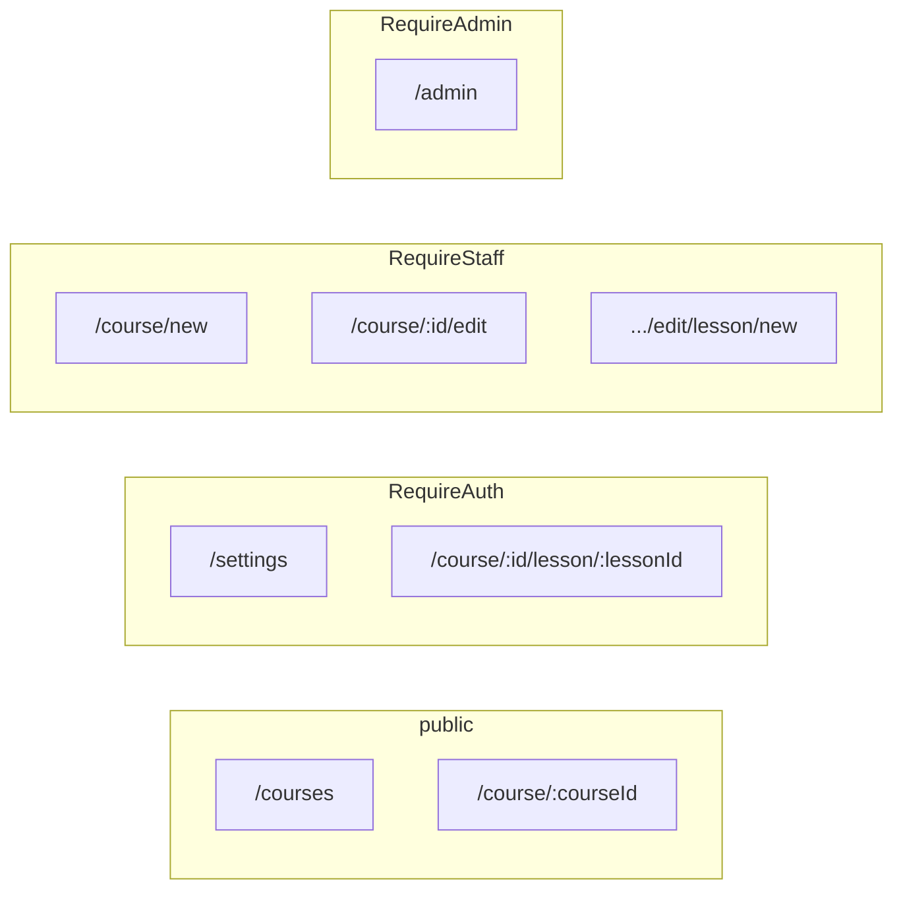

# Frontend overview

Concise map of the `frontend/` SPA (Vite + React). Not a full API reference.

## Stack

| Layer | Choice |
|--------|--------|
| Build / dev server | **Vite** 8 (`@vitejs/plugin-react`) |
| UI | **React** 19, **TypeScript** |
| Styling | **Tailwind CSS** 4 (`@tailwindcss/vite`), **MUI** 9 (`@mui/material` + Emotion), **Lucide** icons |
| Routing | **react-router-dom** 7 (`BrowserRouter`, declarative `Routes`/`Route`) |
| HTTP | **Axios** (shared instances; **qs** for array query serialization) |
| UX | **react-hot-toast** |

Entry: `src/main.tsx` wraps the app in `BrowserRouter` → `AuthProvider` → `ThemeProvider` → `App`.

## Folder structure (schematic)

```text
frontend/
├── index.html
├── vite.config.ts
├── tailwind.config.js, postcss.config.js
├── package.json
└── src/
    ├── main.tsx, App.tsx, index.css
    ├── features/          # vertical slices (screens + local api/helpers)
    │   ├── auth/
    │   ├── courses/
    │   ├── course_detail/
    │   ├── course_edit/
    │   ├── lesson/
    │   ├── dashboard/
    │   ├── admin_panel/
    │   └── settings/
    └── shared/
        ├── api/api.tsx    # axios clients (api, apiAuth, apiArray)
        ├── components/    # layout, nav, guards, inputs, footer
        ├── context/       # ThemeContext, AuthModalContext
        ├── povider/       # AuthContext (note: folder name as in repo)
        ├── hooks/
        ├── interfaces/, types/, constants/
```

Feature modules typically expose a top-level page component (e.g. `Courses.tsx`) and colocate `api.ts` where HTTP calls live.

## Routing

`App.tsx` defines all routes. Guards wrap sensitive pages.



| Path | Guard | Screen |
|------|--------|--------|
| `/` | — | redirect → `/courses` |
| `/courses` | — | course catalog + filters |
| `/dashboard` | — | guest gate or role-specific dashboard |
| `/settings` | RequireAuth | user settings |
| `/admin` | RequireAdmin | admin panel |
| `/course/new`, `/course/:id/edit`, `.../lesson/new` | RequireStaff | course / lesson editor |
| `/course/:courseId` | — | course detail |
| `/course/:courseId/lesson/:lessonId` | RequireAuth | lesson player (video, text, quiz) |
| `*` | — | redirect → `/courses` |

`/profile` redirects to `/settings`.

## State and data fetching

- **Global auth**: `AuthProvider` (`shared/povider/AuthContext.tsx`) holds `user`, `login` / `logout`, `isLoading`, `isAdmin`. Restores `user` + JWT from `localStorage` on load and sets `Authorization` on the default Axios instance.
- **Theme / modals**: `ThemeContext`; `AuthModalContext` supplies `openLogin` / `openRegister` for the nav-driven auth overlay (`App` local state chooses Login vs Register; `Auth` renders the form).
- **Server data**: no React Query / Redux in `package.json`. Features use **async functions** in per-feature `api.ts` files calling `api`, `apiAuth`, or `apiArray` from `shared/api/api.tsx`. Pages/components use **React hooks** (`useState`, `useEffect`, etc.) to load and store responses. `useDebounce` exists for search/filter UX.

Base URL for Axios is configured as `http://localhost:8000/` in `shared/api/api.tsx` (backend expected on that host).

## Feature areas (aligned with routes)

| Area | Role / access | Purpose |
|------|----------------|---------|
| **Courses** | Public | List, search, sort, filter courses |
| **Course detail** | Public | Metadata, enrollment actions, ratings (UI varies by role) |
| **Lesson** | Signed-in | Consume lesson content (video, text, quiz) |
| **Course edit / new lesson** | Instructor / admin | CRUD-style authoring for courses and lessons |
| **Dashboard** | Guest sees CTA; signed-in | `student` / `instructor` / `admin` dashboards |
| **Admin panel** | Admin | Platform administration |
| **Auth** | Modal | Login / register against backend |
| **Settings** | Signed-in | Profile / preferences |

## Scripts (`frontend/package.json`)

Run from the `frontend/` directory:

| Command | Action |
|---------|--------|
| `npm run dev` | Vite dev server |
| `npm run build` | `tsc -b` then production bundle |
| `npm run preview` | Serve the production build locally |
| `npm run lint` | ESLint on the project |
